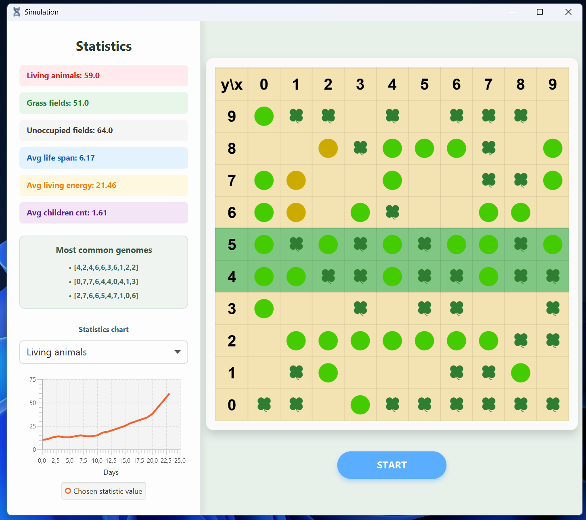
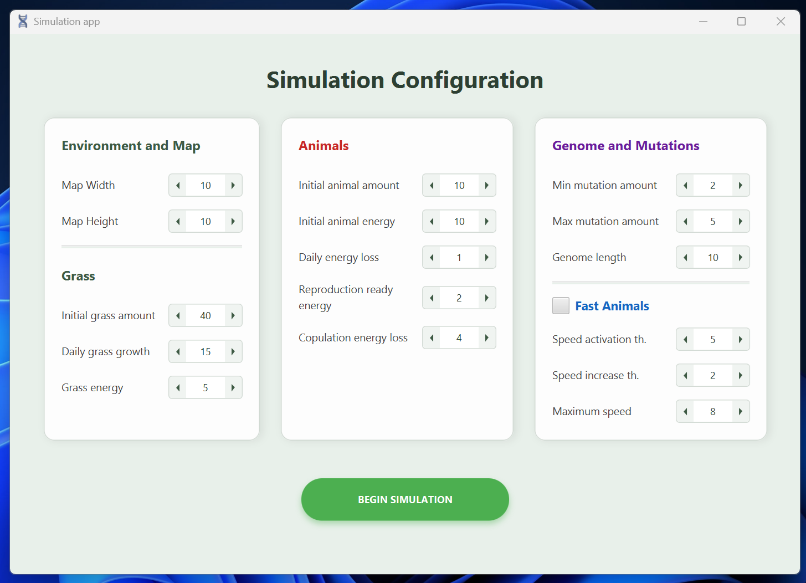

# 🧬 Darwinian Evolution Simulator

> *A Java-based Darwinian evolution simulation featuring a graphical user interface powered by JavaFX. Watch as a grid-based world of steppes and jungles comes alive with creatures foraging, surviving, and passing on their genes.*

The simulation allows users to observe the evolutionary process over thousands of days as animals adapt their movement patterns to survive in their dynamic environment.

---

## ⚙️ Core Mechanics

* 🌍 **The World:** A rectangular grid behaving like a globe (wrapping horizontally, bouncing vertically at the poles). The center features a Jungle (20% of the map) where plant growth is highly concentrated (Pareto principle: 80% of new plants grow here).
* 🧭 **Genetics & Movement:** Each animal possesses a genome consisting of $N$ genes (values `0-7`) that dictate its daily rotation (`0` = straight, `1` = 45° right, `4` = U-turn). Genes activate sequentially, driving the animal's movement.
* ⚡ **Energy System:** Animals lose energy every day. If their energy drops to zero, they die. Energy is replenished by finding and eating plants.
* ❤️ **Reproduction & Mutations:** When two well-fed animals meet on the same tile, they breed. The offspring's genome is a crossover of the parents' genes, split proportionally based on the parents' energy levels. The offspring also undergoes random genetic mutations.
* 🔄 **Daily Cycle:** Every day follows a strict sequence:
    1. Remove dead animals.
    2. Move survivors.
    3. Consume food.
    4. Breed eligible pairs.
    5. Sprout new plants.

---

## 🚀 Features

### 🛠️ Base Functionality
* **Configuration Menu:** A dedicated JavaFX setup screen to define initial simulation parameters.
* **Live Animation:** Visual representation of the grid, clearly differentiating between plants, empty tiles, and animals.
* **Playback Control:** Play, pause, and resume the simulation at any time.
* **Real-time Statistics:** Live tracking of:
    * 🐾 Animal & 🌱 Plant populations
    * 🟩 Free tiles
    * 🔋 Average energy
    * 🪦 Average lifespan (for deceased animals)
    * 👶 Average child count
    * 👑 Most dominant genotypes

* **Multi-Simulation Support:** Run multiple independent simulations simultaneously in separate windows.
* **Energy Visualization:** Visual indicators (e.g., color-coding) to display the energy levels of individual animals on the map.
* **Live Charts:** Real-time graph visualization for selected statistics (e.g., average energy or lifespan) as the simulation progresses.
* **CSV Export:** Automatic daily logging of simulation statistics to a `.csv` file for external data analysis (e.g., in Excel).
* **Dynamic Map Scaling:** Responsive visual grid that scales dynamically based on the configured map dimensions.
* **Fast Animals Variant:** High-energy animals can move multiple tiles in a single day. During these rapid movements, they trample (destroy) un-eaten plants and stop early if they collide with another animal. Collisions result in a double energy penalty.

---

## 🎛️ Configuration Parameters

The configuration screen allows deep customization before launching a simulation.

### 🌍 Environment and Map
| Parameter | Default | Range | Description |
| :--- | :---: | :---: | :--- |
| **Map Width** | 10 | 1 - 100 | Horizontal grid size. |
| **Map Height** | 10 | 1 - 100 | Vertical grid size. |
| **Initial grass amount** | 40 | 0 - 1000 | Starting plant count. |
| **Daily grass growth** | 15 | 0 - 1000 | New plants spawned per day. |
| **Grass energy** | 5 | 0 - 1000 | Energy gained per eaten plant. |

### 🦊 Animals
| Parameter | Default | Range | Description |
| :--- | :---: | :---: | :--- |
| **Initial animal amount** | 10 | 1 - 10000 | Starting population. |
| **Initial animal energy** | 10 | 1 - 10000 | Starting energy for the initial population. |
| **Daily energy loss** | 1 | -10000 - 10000 | Energy lost by each animal daily. |
| **Reproduction ready energy** | 2 | 0 - 10000 | Minimum energy required to breed. |
| **Copulation energy loss** | 4 | 0 - 10000 | Energy transferred from parent to offspring. |

### 🧬 Genome and Mutations
| Parameter | Default | Range | Description |
| :--- | :---: | :---: | :--- |
| **Min mutation amount** | 2 | 0 - 1000 | Minimum mutated genes in offspring. |
| **Max mutation amount** | 5 | 0 - 1000 | Maximum mutated genes in offspring. |
| **Genome length** | 10 | 1 - 1000 | Total genes dictating movement behavior. |

### ⚡ Fast Animals Variant (Optional)
Animals with excess energy can move multiple tiles per day. 

| Parameter | Default | Range | Description |
| :--- | :---: | :---: | :--- |
| **Speed activation th.** | 5 | 0 - 1000 | Minimum energy needed to trigger fast movement. |
| **Speed increase th.** | 2 | 1 - 1000 | Excess energy required per extra tile of speed. |
| **Maximum speed** | 8 | 1 - 1000 | Maximum tiles traversed in a single day. |

---

## 💻 Technologies Used

* **[Java](https://www.java.com/):** Core simulation logic and object-oriented architecture.
* **[JavaFX](https://openjfx.io/):** Graphical User Interface, canvas rendering, and real-time charting.